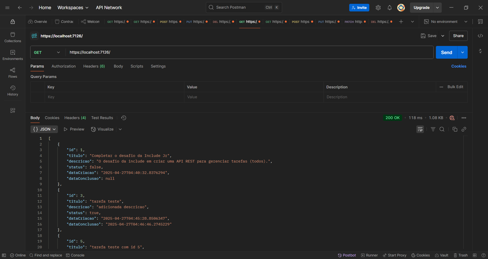
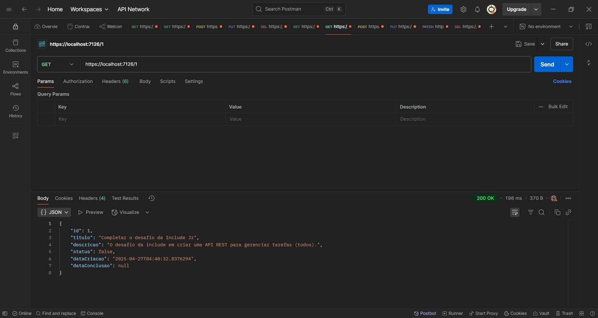
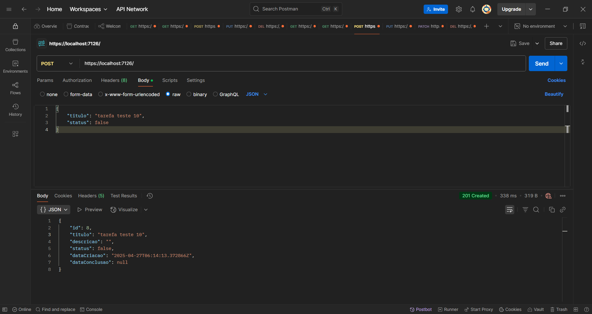
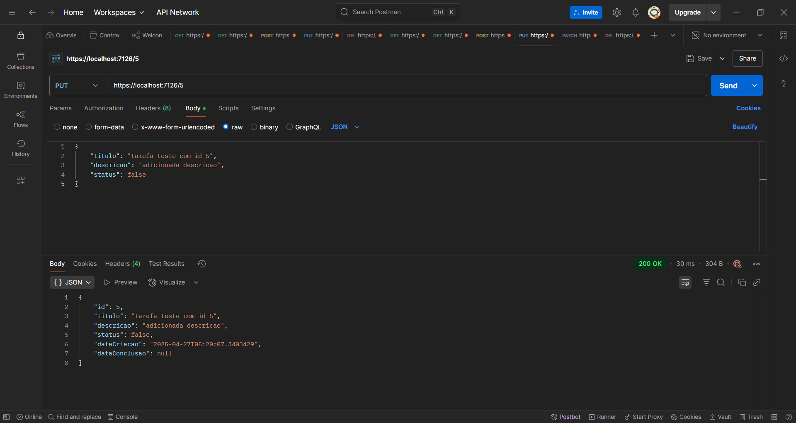
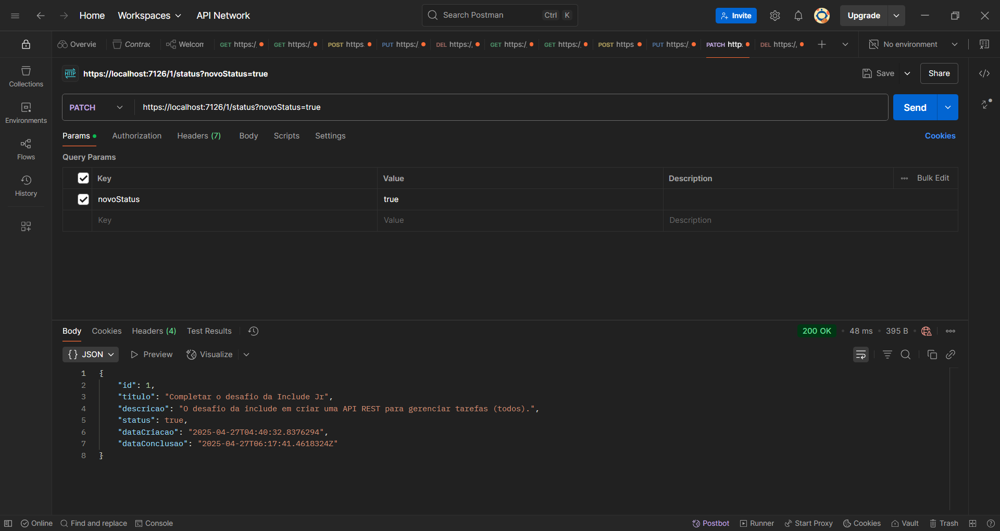
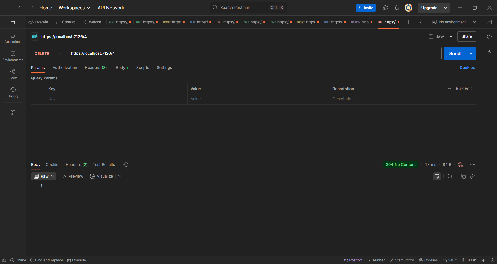

# Desafio Include Jr 2025.1

Este repositório tem o propósito da implementação do desafio do processo seletivo da empresa junior **Include Jr**.

## Sobre o desafio
O desafio consiste em implementar uma API REST funcional para gerenciamento de tarefas diversas (*todos*). 

O modelo da tarefa inclui:
- id: identificador único
- descricao: texto da tarefa
- status: se está concluída ou não
- dataCriacao: data de criação da tarefa
- dataConclusao: data de termino da tarefa

E a API possui as seguintes funções:
- Criação das Tarefas
- Atualização de uma tarefa (via ID)
- Exclusão de uma tarefa (via ID)
- Atualizaçaõ do status de uma tarefa (concluída ou não)
- Visualização de todas as tarefas
- Visualização de uma tarefa via ID

## Implementação
A implementação da API foi feita com o .NET, utilizando API com controllers. Abaixo, alguns detalhes sobre a implementação.

### Tecnologias
- **Linguagem:** .NET (C#)
- **Armazenamento:** SQLite
- **Testes:** Postman

### Modelo em C#
```csharp
public class Tarefa
{
    public int Id { get; set; }
    public string Titulo { get; set; } = string.Empty;
    public string Descricao { get; set; } = string.Empty;
    public bool Status { get; set; } // true = concluída, false = não concluída
    public DateTime DataCriacao { get; set; }
    public DateTime? DataConclusao { get; set; }
}
```

### Testando a API
Primeiro, execute o programa com:
```bash
dotnet watch run -lp https
```

Depois, é possível testar a API utilizando uma ferramenta como Postman ou Insomnia.

#### Exemplo:
- Método: ```POST```
- URL: ```https://localhost:7126/```
- Body (JSON): 
``` json
{
    "titulo": "tarefa teste",
    "status": "false"
}
```

### Telas do Postman
#### GetAll

#### GetById

#### POST

#### PUT

#### PATCH

#### DELETE
